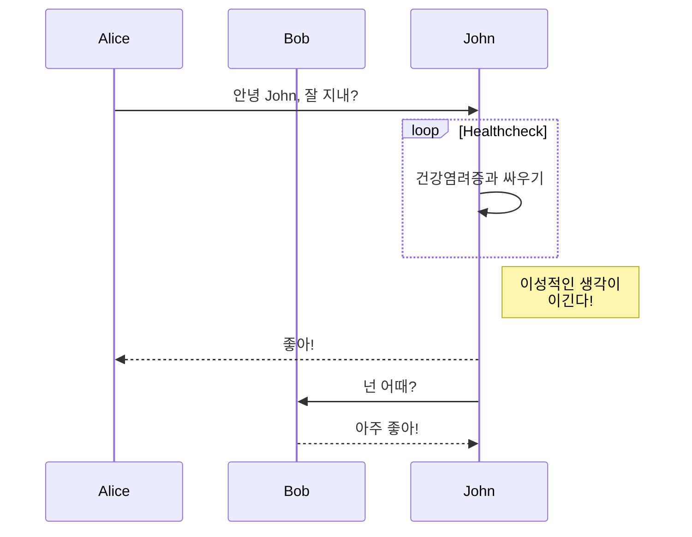

이 jekyll 테마는 마크다운에서 다이어그램을 렌더링하기 위해 [mermaid.js](https://mermaid.js.org/)를 지원합니다.

mermaid를 지원하려면 포스트의 프론트 매터에 `mermaid: true`를 설정해야 합니다.

```markdown
---
title: mermaid.js로 다이어그램 그리기
date: 2023-08-31
layout: post
mermaid: true
---
```

그런 다음 마크다운에서 mermaid 구문을 사용할 수 있습니다:

```
graph TD;
    A-->B;
    A-->C;
    B-->D;
    C-->D;
```


또는 더 복잡한 예제도 가능합니다:

```
sequenceDiagram
    participant Alice
    participant Bob
    Alice->>John: 안녕 John, 잘 지내?
    loop Healthcheck
        John->>John: 건강염려증과 싸우기
    end
    Note right of John: 이성적인 생각이<br/>이긴다!
    John-->>Alice: 좋아!
    John->>Bob: 넌 어때?
    Bob-->>John: 아주 좋아!
```



더 많은 예제는 [mermaid.js 웹사이트](https://mermaid.js.org/intro/)를 참조하세요.
